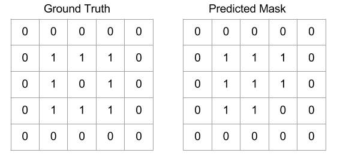
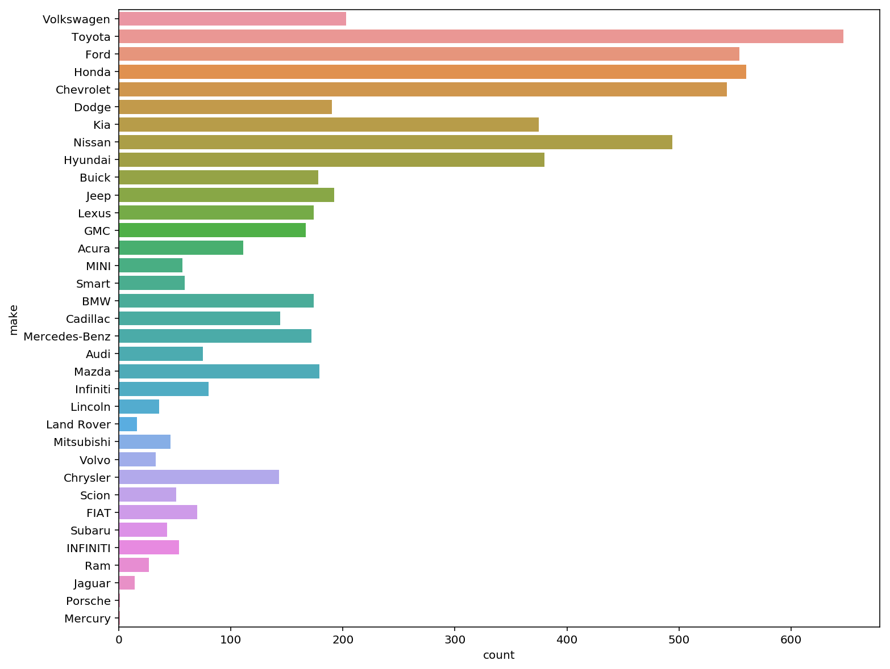
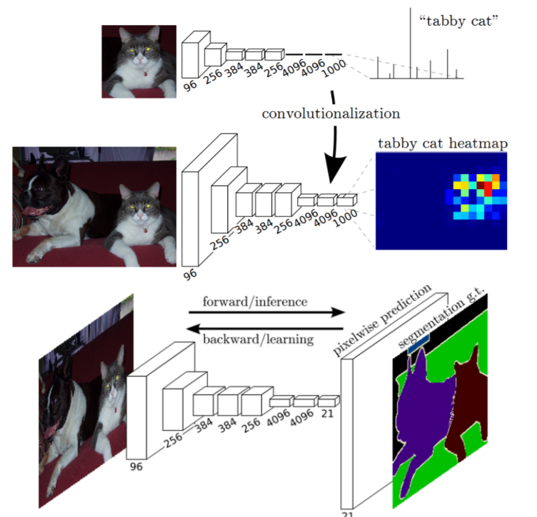
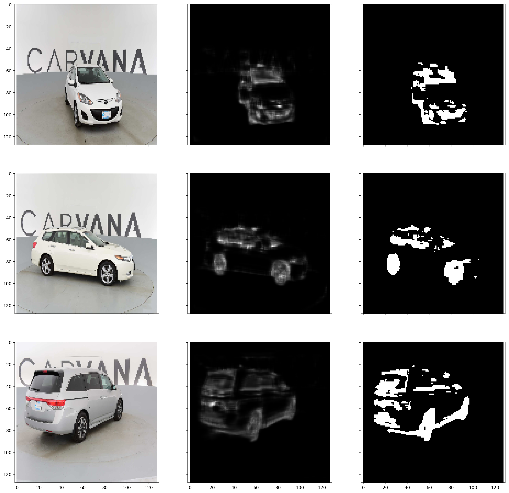
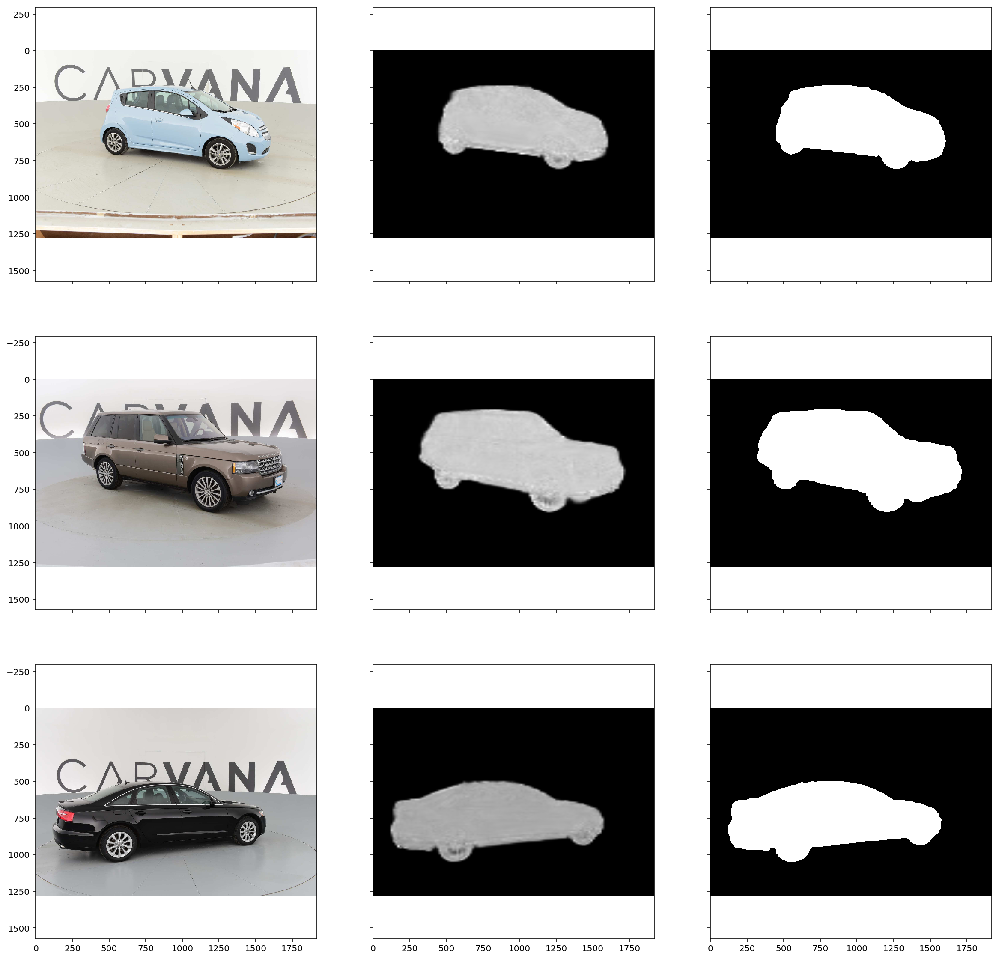

# Machine Learning Engineer Nanodegree
## Capstone Project
Nitish Puri  
August 31st, 2017

## Using Deep Learning for Image Masking

## I. Definition

### Project Overview

One of the reason I decided to do the Machine Learning Nanodegree was my growing interest in
computational perception. There are several closely related perception problems that are being 
addressed using the rapidly emerging field of deep learning. This project is one variant of the 
problem of [Image Segmenation](https://en.wikipedia.org/wiki/Image_segmentation) inspired from 
the [Kaggle Image Masking Challenge](https://www.kaggle.com/c/carvana-image-masking-challenge).   

Historically, the problem of image segmentation has been solved by using traditional Computer 
vision principles like k-means clustering, thresholding, edge detection and even lossy compression 
techniques. These techniques require careful engineering of the image pipeline, which can differ a lot 
between different problems or different datasets.The problem of image segmentation has been studied in 
various domains ranging from robot perception to medical image analysis and the results obtained and 
models created are transferable to these domains as well.

The challenge is organized by [Carvana](https://www.carvana.com/). An interesting part of their innovation is a custom rotating photo studio that automatically captures and processes 16 standard images of each vehicle in their inventory. While they capture high quality photos, bright reflections and cars with similar colors as the background cause automation errors, which requires a skilled photo editor to fix. In this project we are going to develop an algorithm that automatically removes the photo studio background. This will allow Carvana to superimpose cars on a variety of backgrounds. We will be analyzing a dataset of photos, covering different vehicles with a wide variety of year, make and model combinations.


### Problem Statement
As mentioned in the previous section, we are provided with 16 standard images(1918 X 1280) of each 
vehicle(318 vehicle categories for the training data) in their inventory. We also have a corresponding image mask(1918 X 1280) for each input 
image. The problem is in automatically create an image mask for unseen images of automobiles in a 
similar setting. One potential solution that I could immediately come think of was using Deep Neural 
Network that would label each pixel of the input image as belonging to background or automobile. The 
background pixels can then be masked to create an image mask for the given image.   
Specifically we will be using a U-net architecture that use Convolution layers to generate pixel level classification on the input image. These architectures are discussed in the following sections in more detail.

### Metrics

[Dice coefficient](https://en.wikipedia.org/wiki/S%C3%B8rensen%E2%80%93Dice_coefficient) can be used as an evaluation metric for the problem. Dice coefficient is a statistic used for comparing the similarity of two samples. Its range goes from *0* meaning no similarity to *1* meaning maximum similarity. It can be used to compare the pixel-wise agreement between a predicted segmentation and its corresponding ground truth. The formula is given by:   
   
where X is the predicted set of pixels and Y is the ground truth. The Dice coefficient is defined to be 1 when both X and Y are empty. For example consider these two example 5X5 image masks.   
   

Here,   
X = 8,   
Y = 8,   
X & Y = 6   

So, 
QS = (2 * 6)/(8 + 8)   
QS = 0.75    

The final score can be calculated as the mean of the Dice coefficients for each image in the test set.   

We can convert this to a loss function by using    
`dice_loss = 1 - QS`   

This can be augmented with `binary_crossenntropy` to calculate a more robust loss function.   


## II. Analysis
_(approx. 2-4 pages)_

### Data Exploration

Here are some of the questions that i wanted to answer while progress7ing through this project.

* Can I train a model to predict the manufacturer?
* Background is always the same. how can i take advantage of that? 
* How do we/network deal with the reflections?

Since this is a Kaggle competition, we already have separate test and train data available [here](https://www.kaggle.com/c/carvana-image-masking-challenge/data).   
Training data is in the form of 318 vehicle samples with 16 poses each. Each car has an associated metadata,  

   

Corresponding to each car image we have a single channel mask. Our goal is to model a neural network that can learn how to generate this mask image given the RGB input.


Here are some samples shown with masks overlaid,   
   

#### Car manufacturer distribution   
Also, we can get a distribution of car manufacturers in the complete dataset.   
   

These results show the distribution in train and test sets.   
**Training data**

**Test data**


As a *side quest* I decided to train a very crude model that can predict car manufacturer given a car image. Here is the model summary,   
   

We use `categorical_crossentropy` loss and optimize this model using `Adam`.

Here is the learning graph for the model.   
   

This model can also be improved by using data augmentation methods used in the following sections.

#### Corrupt data   
during random visualization of the dataset i was able to find out a few samples that do not have a (nearly)perfect mask. These anomalies are mostly because of very thin apendages such as spoilers or antennas, regular patterns such as wheel spokes or translucent features such as glasses. These samples may cause issues, and we can try to improve the score by removing these samples from the train dataset. However, I have decided to not remove these samples and rely on data augmentation to provide regularization effects against these samples.   
   


### Algorithms and Techniques   

CNNs have been known to perform well for image recognition problems. The next step after classification is segmentation, which has its applications in autonomous driving, human-machine interaction, computational photography, image search engines, augmented reality and medical image diagnostics to name a few. A brief overview of various deep learning techniques is done [here](https://arxiv.org/pdf/1704.06857.pdf).   
The main idea behind these networks is to output spatial maps instead of classification scores. This is accomplished by replacing *fully connected* layers with *convolution* layer. Here is an illustration from one of the earlier works to use this technique, [Fully Convolution Networks for Semantic Segmentation](https://arxiv.org/abs/1411.4038).   
   

Despite the power and flexibility of the FCN model, it still lacks various features which hinder its application to certain problems and situations: its inherent spatial invariance does not take into account useful global context information, no-instance awareness is present, efficiency is still far from real time execution at high resolutions, and it is not completely suited for unstructured data such as 3D point clouds or models.   
There have been various different approaches to address these issues, viz. [SegNet]() which uses Encoder-Decoder type network to output a high resolution map.   
   

These methods have received significant success since fine-grained or local information is crucial to achieve good pixel-level accuracy. However, it is also important to integrate information from the global context of the image to be able to resolve local ambiguities. Vanilla CNNs struggle to keep this balance, pooling layers being one of the sources that dispose of global context information. Many approaches have been taken to make Vanilla CNNs aware of the global information. One such approach is multi-scale aggregation[74].
   

Here, inputs at different scales is concatenated to output from convolution layers and fed further into the network.   
In this project we are going to use *u-net*, a variation of the above approach for training and inference. This model has been applied to [medical image segmentation])(https://arxiv.org/abs/1505.04597) on data with segmentation masks. This is very similar to our problem and is a simplified version of the general problem of image segmentation and multiple instance learning with multiple(hundreds) classes.   


### Benchmark   
As a benchmark model we can use a simplified CNN architecture containing only a couple of fully convolution layers, without any pooling or downsampling. We use this simple architecture to show that even such a simple model improve its results on the given problem. Though the size of the network and number of learnable parameters may not be sufficient to learn the complexity of the problem at hand.   
Here is the benchmark network,   
```python
baseline_model = Sequential()
baseline_model.add( Conv2D(16, kernel_size= (3, 3), activation='relu',
                    padding='same', input_shape=(INPUT_SIZE, INPUT_SIZE, 3)) )
baseline_model.add( Conv2D(32, kernel_size= (3, 3), activation='relu', padding='same') )
baseline_model.add( Conv2D(1, kernel_size=(5, 5), activation='sigmoid', padding='same') )

baseline_model.compile(Adam(lr=1e-3), bce_dice_loss, metrics=['accuracy', dice_coef])
```
where, `INPUT_SIZE = 128` while training for the benchmark. And, the model summary,   
   

However, before discussing further about this benchmark, I would like to show another *simple* benchmark model.
#### Another Benchmark
We can also use a second benchmark, not based on an ML based model. Here we take samples from the training set and calculate an average mask from the corresponding masks. Now this average mask can be used as a predicted mask for each test data. This benchmark is taken directly from a kaggle [post](https://www.kaggle.com/zfturbo/baseline-optimal-mask/code).

Here is the average mask created as a benchmark,   


This mask gets a score of **0.7491** on the Kaggle public leaderboard.

#### Coming back to our benchmark model
Here are the results obtained after *20 epochs* of the above model.
   

Training for this model is done without using any of the augmenting functions discussed later in preprocessing step. This model took ~5 min per epoch on NVidia GTX 960M with 2GB Memory.
The model received a public score of **0.8848** on Kaggle.
Here are some predictions visualized from the network(*Input, Softmax prediction, Prediction>0.001*).



Here, we can see that even this simple 3 layer model is able to detect a general shape of the automobile. Also, this simple model shows a significant improvement over the previous benchmark score of **0.7491**. This proves that using CNN's can be fruitful for the problem at hand.   

## III. Methodology

### Data Preprocessing   

The training data comes in the form of `1918X1280 RGB` images. Our U-Net model is composed of Fully Convolutional layers, which expect the input data in the form of 3D Matrices(multiple 2D stacked layers).So, there is no necessity for preprocessing the data for the model to start learning.   
However, we need to consider other problems like computational complexity and overfitting.   
* Convolution networks can be very compute intensive, and running through the full res input images would take a lot of time to converge. So, we start with a low res input `(128X128)` to see if it offers any improvement over the baseline models.
* To help prevent large updates and variations in our gradients, we generally use data with zero mean and unit variance. Here, we have decided to not use that approach as our first step and start with a crude approximation to just normalize the input imagery so that its range is now between `(0, 1)`.
* We have `5088` samples in our training data and `100064` samples in the test set. This shows that the training set *might* not be able to provide a good range of variations in the inputs. We can try to overcome this issue by augmenting our training data using random shifts. 
    * Randomly shift pixel values in HSV space. This is done to add variations in the image in the form of tint and brightness. Using HSV space for this is generally better because it is more uniform i.e. less noisy w.r.t. local changes, and also slight shifts in HSV space might look more *natural* than similar shifts in RGB space.
    * Randomly scale and rotate the input image while preserving the input dimensions. This would also help us make our model invariant changes in the scale(or distance from camera) of vehicle. We need to make sure that we don't use very large values which might cause the automobile to get cropped or change the orientation drastically.
    * We introduce a random horizontal flip to the inputs.
    Here are some samples produced after augmentation.   
       
       

### Implementation

The project is implemented in `python 3` using `Keras` for building and training neural network and `OpenCV` for image processing. Different parts of the project are divided into modules in the form of `.py` files. These are explained below,
* `data.py` : Utility for reading in csv files for metadata, train masks and listing testing and training datasets.
* `encoder.py` : Utility for converting image mask to *run length encoding*.
* `filename.py` : Utility for getting car id and angle id from filename and vice versa.
* `generator.py` : Generator functions used while training the network.
* `image.py` : Utilities to open and show image given car code and angle code.
* `losses.py` : Accuracy and loss functions for segmentation model. Defines Dice accuracy and loss function.
* `models.py` : Functions to generate the UNet model, baseline model and manufacturer model.
* `params.py` : Some global parameters and constants used throughout different files and utilities.
* `preprocess.py` : Functions to add random variations to a given image for data augmentation.
* `read_activations.py` : Generate and display activations produced by the given input in the intermediate layers of the model.
* `vis.py` : Provides various visualization utils for data exploration, plotting results and visualizing model filters.
* `zf_baseline.py` : File taken from a Kaggle kernel to produce avg baseline mask. 

The project is initially implemented in *Jupyter Notebooks* for exploration and then plugged into a console program using `run.py`.

#### Metrics
As previously discussed, we are using `dice coefficient` as our metric for accuracy. This is converted to a loss function by using `dice_loss = 1 - dice_coeff`. 

These metrics are implemented in `losses.py`.   
I was getting some weird type mismatch errors if i used the same implementation of dice coefficient while calculating it manually, so I had to keep two different implementations of the function, one that uses `Keras/tf`constructs, and one that uses `numpy` constructs.   

#### Model Architecture
For our final model implementation we are going to use a UNet based model as discussed previously. The model is defined in `models.py`. Here is a high level illustration for the model,   
This is a simple **Conv block** consisting of a single convolution layer followed by a batch normalization layer and a relu activation layer.    
   

These conv blocks can be chained together to form *double* or *triple* convolution blocks which I am using in the following illustration.   
   

The UNet architecture is composed of `encode-decode` architecture along with `concatenation` from the previous high res layers. The last layer of the model is a `(1 X 1)` convolution followed by a `sigmoid` activation function. We train this model using `RMSprop` with an initial learning rate of `0.0001`. 

The initial model that I implemented consisted of deeper layers with `1024` filters. However my GPU was not able to handle that kind of memory even with a batch size of `8`. So, I decided to use remove those layers from in between and use a center layer of `512` filters instead, with `16` samples per batch.   
Further, I added the following callbacks to the fit function to monitor the learning process,
* `ReduceLROnPlateau(monitor='val_loss', factor=0.1, patience=4, verbose=1, epsilon=1e-4)` : This reduces the learning rate by a factor of `0.1` if `val_loss` does not improve by more than `1e-4` for `4`
 iterations.
 * `EarlyStopping(monitor='val_loss', patience=8, verbose=1, min_delta=1e-4)` : This callback stops the learning process if `val_loss` does not improve by `1e-4` for `8` consecutive iterations.

 Using this configuration, I was able to achieve the following learning graph.   
   

Here we can clearly see that the model did not improve much after the first `4` epochs, and stopped after `20` epochs. 


## IV. Results

### Model Evaluation and Validation
Since this is a Kaggle competition, the test data that we have is not labeled, i.e. we don't have correct output masks available for the test dataset. So, for evaluating our model we can either remove some data from the training set and keep aside for testing(before the train-validation split). However, I decided to use the score provided by Kaggle public leaderboard for model evaluation. To do this, I needed to predict the masks for each of the images available in the test set(`/input/test`), and convert them to rle encoding for submission. This model achieves a score of **0.9886** on the public leaderboard.    
Masks generated by our final model.   
*Original Image, Sigmoid Prediction, Prediction with threshold(0.0001)*
   

The masks produced by our final model look reasonable to the naked eye, and they are a huge improvement over our last result using a simple 3 layer CNN model.   

Further, we can also validate how good our model is in generating masks for different *kind* of images that it has never seen before. This is not a part of the kaggle challenge and hence the input images are just some freely available stock images taken from [here](!slhslj)


## V. Conclusion

### Free-Form Visualization
One of the major issues with Neural networks is that of reasonability, i.e. given the model architecture and weights it is very difficult to readon *why* the model behaves the way it does. Some of these issues can be addressed by visualizing the intermediate layer activations for a given input.   
In this section we provide some of the intermediate layer activations for the baseline model and our final unet model.   


In this section, you will need to provide some form of visualization that emphasizes an important quality about the project. It is much more free-form, but should reasonably support a significant result or characteristic about the problem that you want to discuss. Questions to ask yourself when writing this section:
- _Have you visualized a relevant or important quality about the problem, dataset, input data, or results?_
- _Is the visualization thoroughly analyzed and discussed?_
- _If a plot is provided, are the axes, title, and datum clearly defined?_

### Reflection
In this section, you will summarize the entire end-to-end problem solution and discuss one or two particular aspects of the project you found interesting or difficult. You are expected to reflect on the project as a whole to show that you have a firm understanding of the entire process employed in your work. Questions to ask yourself when writing this section:
- _Have you thoroughly summarized the entire process you used for this project?_
- _Were there any interesting aspects of the project?_
- _Were there any difficult aspects of the project?_
- _Does the final model and solution fit your expectations for the problem, and should it be used in a general setting to solve these types of problems?_

### Improvement
In this section, you will need to provide discussion as to how one aspect of the implementation you designed could be improved. As an example, consider ways your implementation can be made more general, and what would need to be modified. You do not need to make this improvement, but the potential solutions resulting from these changes are considered and compared/contrasted to your current solution. Questions to ask yourself when writing this section:
- _Are there further improvements that could be made on the algorithms or techniques you used in this project?_
- _Were there algorithms or techniques you researched that you did not know how to implement, but would consider using if you knew how?_
- _If you used your final solution as the new benchmark, do you think an even better solution exists?_

-----------

**Before submitting, ask yourself. . .**

- Does the project report you’ve written follow a well-organized structure similar to that of the project template?
- Is each section (particularly **Analysis** and **Methodology**) written in a clear, concise and specific fashion? Are there any ambiguous terms or phrases that need clarification?
- Would the intended audience of your project be able to understand your analysis, methods, and results?
- Have you properly proof-read your project report to assure there are minimal grammatical and spelling mistakes?
- Are all the resources used for this project correctly cited and referenced?
- Is the code that implements your solution easily readable and properly commented?
- Does the code execute without error and produce results similar to those reported?


### References

1. [Carvana Image Masking Chalenge](https://www.kaggle.com/c/carvana-image-masking-challenge)
2. [A Review of Deep Learning Techniques Applied to Semantic Segmentation](https://arxiv.org/pdf/1704.06857.pdf)   
3. [Convolution Networks for Visual Recognition](http://cs231n.github.io/)
4. [Fully Convolution Networks for Semantic Segmentation](https://arxiv.org/abs/1411.4038)
5. [SegNet]()
6. [Multi-Scale Convolutional Architecture for Semantic Segmentation](http://www.ri.cmu.edu/pub_files/2015/10/CMU-RI-TR_AmanRaj_revision2.pdf)   
7. [U-Net: Convolutional Networks for Biomedical Image Segmentation](https://arxiv.org/abs/1505.04597)
8. [DeepLab](https://arxiv.org/abs/1606.00915)